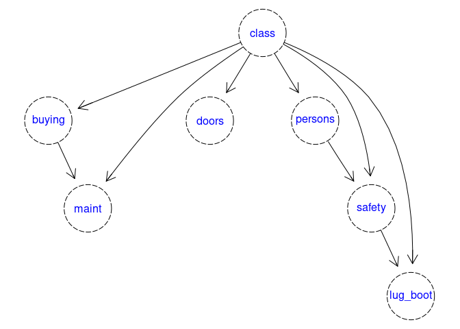

bnclassify
==========

[](https://cran.r-project.org/package=bnclassify)


[](http://depsy.org/package/r/bnclassify)
[](https://codecov.io/github/bmihaljevic/bnclassify?branch=master)
[](https://travis-ci.org/bmihaljevic/bnclassify)
[](https://ci.appveyor.com/project/bmihaljevic/bnclassify)

Implements algorithms for learning discrete Bayesian network classifiers
from data, as well as functions for using these classifiers for
prediction, assessing their predictive performance, and inspecting and
analyzing their properties.

Example
=======

Load a data set and learn a one-dependence estimator by maximizing
Akaike’s information criterion (AIC) score.

``` r
library(bnclassify)
data(car)
tn <- tan_cl('class', car, score = 'aic')
tn
#> 
#>   Bayesian network classifier (only structure, no parameters)
#> 
#>   class variable:        class 
#>   num. features:   6 
#>   num. arcs:   9 
#>   learning algorithm:    tan_cl
plot(tn)
```



After learning the network’s parameters, you can use it to classify
data.

``` r
tn <- lp(tn, car, smooth = 0.01)
p <- predict(tn, car, prob = TRUE)
head(p)
#>      unacc          acc         good        vgood
#> [1,]     1 3.963694e-09 5.682130e-09 4.269700e-09
#> [2,]     1 1.752769e-09 3.310473e-12 3.236335e-09
#> [3,]     1 3.730170e-09 1.090296e-08 1.800719e-12
#> [4,]     1 3.963694e-09 5.682130e-09 4.269700e-09
#> [5,]     1 4.562294e-09 6.965323e-09 4.536532e-09
#> [6,]     1 4.281155e-09 5.366306e-09 5.168828e-09
p <- predict(tn, car, prob = FALSE)
head(p)
#> [1] unacc unacc unacc unacc unacc unacc
#> Levels: unacc acc good vgood
```

Estimate predictive accuracy with cross validation.

``` r
cv(tn, car, k = 10)
#> [1] 0.9415736
```

Or compute the log-likelihood

``` r
logLik(tn, car)
#> 'log Lik.' -13280.39 (df=131)
```

Install
=======

Make sure you have at least version 3.2.0 of R. You can install
`bnclassify` from CRAN:

``` r
install.packages('bnclassify')
```

Or get the current development version from Github:

``` r
# install.packages('devtools')
devtools::install_github('bmihaljevic/bnclassify')
# devtools::install_github('bmihaljevic/bnclassify', build_vignettes = TRUE)
```

Ideally, you would use the `build_vignettes = TRUE` version, and thus
get the vignettes, but it requires programs such as texi2dvi to be
installed on your side.

For network plotting and prediction with incomplete data you will also
need two packages from Bioconductor. Install them with:

``` r
source("http://bioconductor.org/biocLite.R")
biocLite(c("graph", "Rgraphviz"))
```

Overview
========

See an overview of the package and examples of usage:

``` r
vignette('overview', package = 'bnclassify')
#> Warning: vignette 'overview' not found
```

See the list of main functionalities.

``` r
?bnclassify
```

Use the usage vignette for more details on the functions.

``` r
vignette('usage', package = 'bnclassify')
```

Then have a look at the remaining vignettes.

``` r
browseVignettes("bnclassify")
```
